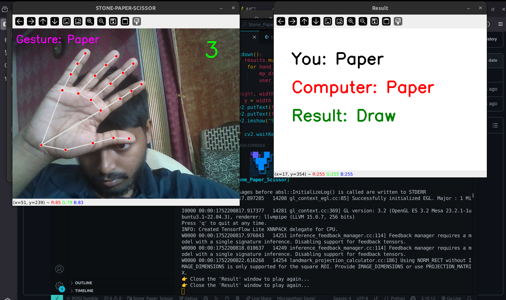

# project 0

i have create a stone paper scissor game.

## Software Required
-`Python3`
-`OpenCV`

## Let's Play

```bash
pip install opencv-python
```
```bash
python3 ~/stone-paper-sissor.py
```

## Test Image


